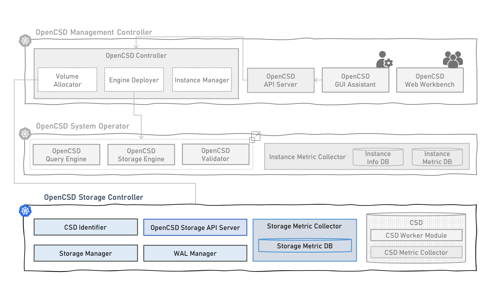

# Introduction of Deployment for OpenCSD Storage Controller
-------------

This is yaml files and scripts for opencsd management controller deployment.

Developed by KETI



## Contents
-------------
[1. Requirement](#requirement)

[2. Node Requirement](#node-requirement)

[3. How To Run](#module-description-and-how-to-run-pod)

[4. How To Debug](#how-to-debug)

[5. Governance](#governance)


## Requirement
>   kubernetes 1.26 <br>
>   containerd 1.6.21 <br>
>   go 1.22.1 <br>

## Node Requirement
### Storage Node Requirement
```bash
kubectl label nodes storage-node1 key=worker
kubectl label nodes storage-node1 layer=storage
kubectl label node storage-node1 node-role.kubernetes.io/worker=
```

## How To Run Pod
```bash
git clone https://github.com/opencsd/OpenCSD-Storage-Controller
cd OpenCSD-Storage-Controller
./1.csd-identifier.sh
./2.stoage-metric-collector.sh
./3.opencsd-storage-api-server.sh
./4.lba2pba-manager.sh
```
```bash
kubectl get pods -n storage-controller
```
```bash
NAMESPACE               NAME                                        READY   STATUS    RESTARTS        NODE
storage-controller      csd-identifier-bxdz7                        1/1     Running   0               storage-node1
storage-controller      opencsd-storage-api-server-8nfv4            1/1     Running   0               storage-node1
storage-controller      opencsd-storage-api-server-mbv7t            1/1     Running   0               storage-node3
storage-controller      opencsd-storage-api-server-x49wk            1/1     Running   0               storage-node4
storage-controller      storage-metric-collector-8rj7j              2/2     Running   0               storage-node4
storage-controller      storage-metric-collector-jclcw              2/2     Running   0               storage-node1
storage-controller      storage-metric-collector-zcdp2              2/2     Running   0               storage-node3  
storage-controller      lba2pba-manager-dh3ss                       1/1     Running   0               storage-node3         
```

## How To Debug
```bash
./debug.sh i # csd-identifier
./debug.sh l # lba2pba-manager
./debug.sh a # storage-api-server
```


## Governance
This work was supported by Institute of Information & communications Technology Planning & Evaluation (IITP) grant funded by the Korea government(MSIT) (No.2021-0-00862, Development of DBMS storage engine technology to minimize massive data movement)

